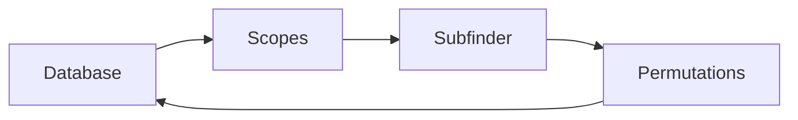

# Overview


In the realm of bug bounty programs, the landscape is teeming with hunters scanning tirelessly for vulnerabilities. However, it's strategic to avoid targeting websites that have already attracted the attention of countless other hunters. Diving into less explored territories can significantly enhance your chances of success. 

For this reason I've developed automation that stores and scans subdomains, focusing solely on extracting newly discovered ones. This proactive approach grants me the advantage of uncovering vulnerabilities ahead of the competition.

# Database Structure
The database structure is relatively simple. I chose to store only the subdomain and the date it was discovered. This streamlined approach makes it easy to filter information, keeps the database compact, and enables me to focus on storing relevant data.

When new data is inserted into the database, only fresh information is added. This strategy enables me to target recently created subdomains by the company, increasing my odds of discovering vulnerabilities with reduced competition.
```sql
INSERT OR IGNORE INTO subdomains (subdomain, created_at) VALUES (?,?)
```

# Scopes
The initial step in the automation process involves retrieving scopes from various bug bounty program providers such as HackerOne, Bugcrowd, YesWeHack, and Integriti. This is achieved by parsing the APIs provided by these programs and filtering for in-scope programs only. 
> In the context of bug bounty programs, 'in-scope' refers to assets that are permitted for hacking, while 'out-of-scope' indicates assets that are restricted from hacking activities.
{: .prompt-info}

# Subfinder
Once the in-scope domains have been parsed, the subsequent step involves running Subfinder on the wildcard domain. [Subfinder](https://github.com/projectdiscovery/subfinder) is a subdomain discovery tool that returns valid subdomains for websites, using passive online sources. 

> Subfinder extracts subdomains from the following APIs: BeVigil, BinaryEdge, BufferOver, C99, Censys, CertSpotter, Chaos, Chinaz, DNSDB, Fofa, FullHunt, GitHub, Intelx, PassiveTotal, quake, Robtex, SecurityTrails, Shodan, ThreatBook, VirusTotal, WhoisXML API, ZoomEye, ZoomEye API, dnsrepo, Hunter, Facebook, BuiltWith
{: .prompt-info}

# Permutations
After Subfinder completes its process, we accumulate a significant number of subdomains. Utilizing these subdomains, I use the [regulator](https://github.com/cramppet/regulator) tool to uncover additional potential subdomains not covered by the listed APIs. This step demands more resources but yields results that are less likely to be accessed by other hunters.

# Cron
The automation takes about 6 hours to finsh so I have a cron job that will run every night at 12am.
```bash
0 0 * * *
```
